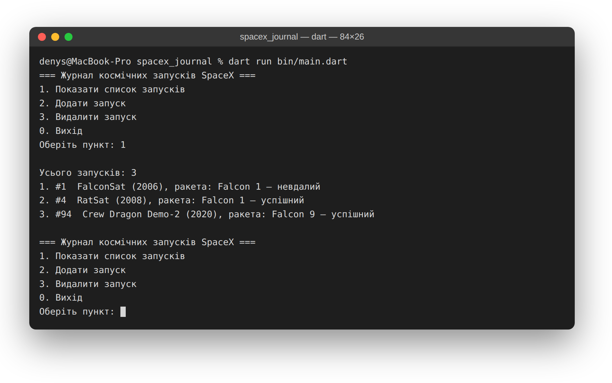
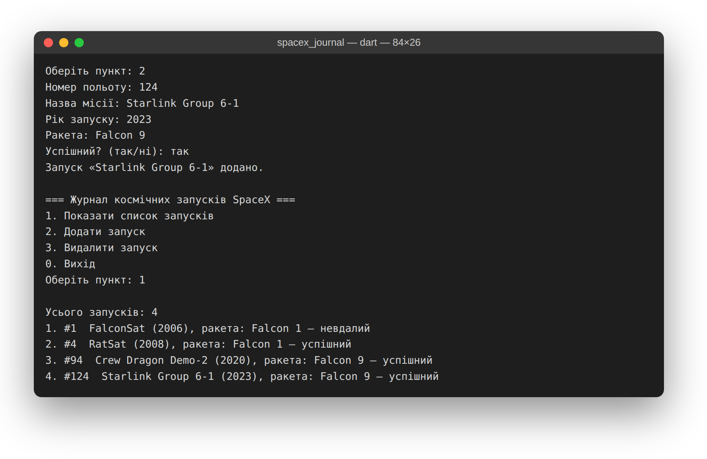
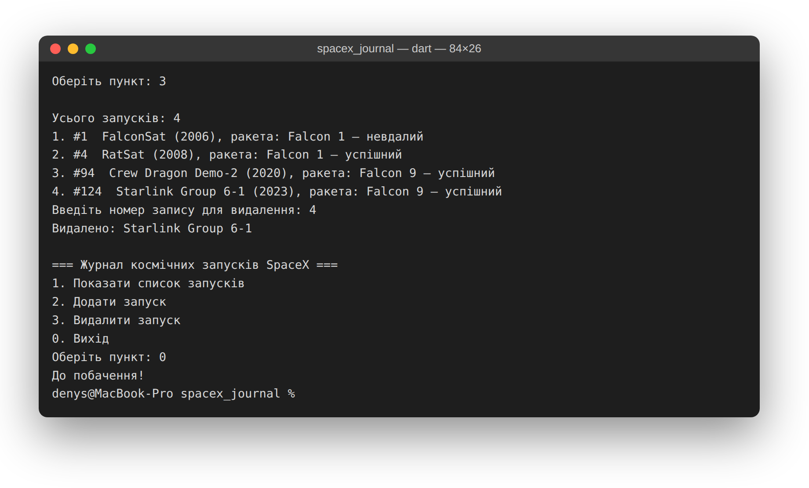

# Журнал космічних запусків

Консольний застосунок на Dart для дисципліни «Кросплатформенне програмування».
Варіант 12 — журнал космічних запусків (предметна область SpaceX).

## Що вміє

- показує список запусків;
- додає новий запуск;
- видаляє запуск за номером у списку;
- зберігає дані у локальному файлі `data.json` і відновлює їх під час наступного запуску.

Дані про кожен запуск: номер польоту, назва місії, рік, ракета, ознака успіху.

## Як запустити

```bash
dart pub get
dart run bin/main.dart
```

Під час роботи програма читає та перезаписує файл `data.json` у корені проєкту.

## Скріншоти роботи

Головне меню та перегляд списку запусків:



Додавання нового запуску:



Видалення запуску та вихід із програми:



## Використане API

Варіант передбачає предметну область SpaceX API v4
(`https://api.spacexdata.com/v4/launches/latest`). На поточному рівні
застосунок працює з локальним файлом `data.json`; отримання даних із
зовнішнього API — наступний етап роботи.
